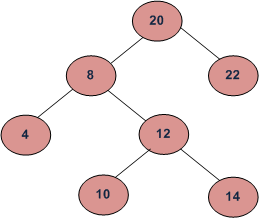

#Zenimax Interview Questions

## Problem 1: Lowest Common Ancestor in a Binary Search Tree
Given values of two values n1 and n2 in a Binary Search Tree, find the Lowest Common Ancestor (LCA).
You may assume that both the values exist in the tree.

### Example:
    
    LCA(4, 14) = 8
    LCA(12, 22) = 20
    
Write the following function

    int FindLowestCommonAncestor (node *root, int value1, int value2);
    
## Problem 2
You will be creating three classes. The first class is called Number, which supports three operations: display, "==" and "+".

1. display: This operation displays the Number itself in its original form (I will explain later).
2. ==: This operation returns true if two Numbers are numerically the same.
3. +: This operation adds the Number itself with another Number and returns a third number whose numeric value is equal 
   to the sum of the numeric values of the former two.
   
The second class is called Integer, which is represented by its integer value. The third class is Fraction, which is 
represented by its numerator and denominator (both are integers). Integer and Fraction are the only two kinds of Numbers. 
Naturally, they support all three operations of Number. To be more precise, you can add two Integers, or two Fractions, 
or one Integer and one Fraction.

For a Fraction, it needs to be displayed in its original form. That is, "2/4" has to be displayed as such, not "1/2" or "0.5".

Write a sample program that can be run that does the following

1. display/comparison/addition of Integer
2. display/comparison/addition of Fraction
3. addition of Integer and Fraction
4. comparison of Integer and Fraction